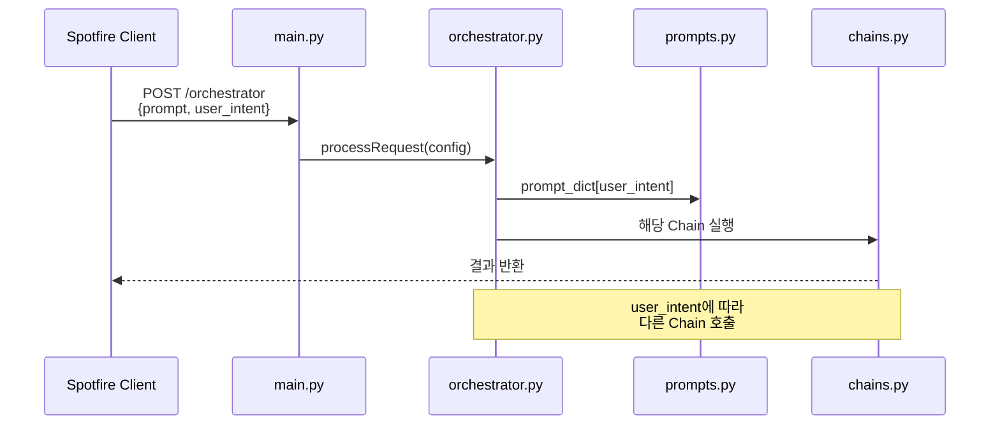
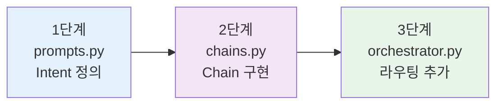
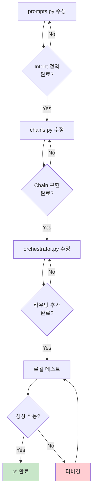

# Spotfire Copilot - 외부 API 연동 개발 가이드
## 새로운 Intent 추가를 위한 실전 가이드

---

## 📋 목차

1. [현재 시스템 구조 요약](#1-현재-시스템-구조-요약)
2. [Intent 추가 작업 흐름](#2-intent-추가-작업-흐름)
3. [실전 예제: 외부 API 연동](#3-실전-예제-외부-api-연동)
4. [체크리스트](#4-체크리스트)

---

## 1. 현재 시스템 구조 요약

### 🔄 요청 처리 흐름



### 📂 핵심 파일 4개

| 파일 | 역할 | 수정 필요 여부 |
|------|------|---------------|
| `prompts.py` | Intent별 프롬프트 & 설정 관리 | ✅ **필수** |
| `orchestrator.py` | Intent → Chain 라우팅 | ✅ **필수** |
| `chains.py` | 실제 처리 로직 (Chain) 구현 | ✅ **필수** |
| `main.py` | API 엔드포인트 | ❌ 수정 불필요 |

---

## 2. Intent 추가 작업 흐름

### 🎯 3단계 작업



---

## 3. 실전 예제: 외부 API 연동

### 목표
**"외부 환율 API를 호출하여 매출 데이터를 환산하는 기능 추가"**

---

### ✅ 1단계: Intent 정의 (prompts.py)

**파일:** `app/prompts.py`

```python
# 파일 하단에 추가

# 1. 프롬프트 템플릿 정의
_external_api_currency = {
    "system_prompt": """You are a helpful assistant that can call external APIs.
When user asks about currency conversion:
1. Call the external API to get exchange rates
2. Convert the amounts
3. Return the result in Korean

Answer in Korean.""",
    "system_prompt_parameters": None,
    "use_secondary_model_plugin": False,
    "llm_name": CHAT_COMPLEX_MODEL_NAME,  # 이미 정의된 변수 사용
    "llm_mode": "chat",
    "temperature": 0.2,
    "index_name": None,
    "index_score_threshold": None,
    "index_topk": None,
    "retriever_type": None
}

# 2. prompt_dict에 등록
prompt_dict["ExternalAPI_Currency"] = _external_api_currency
```

**핵심 포인트:**
- `system_prompt`: LLM에게 주는 지시사항 (한국어 답변 명시)
- `llm_name`: 사용할 모델 (기존 변수 재사용)
- `temperature`: 0.2 (일관된 답변)

---

### ✅ 2단계: Chain 구현 (chains.py)

**파일:** `app/chains.py`

#### 2-1. 외부 API 호출 함수 추가

```python
# 파일 상단 import 섹션에 추가
import requests
from typing import Dict

# 파일 중간에 함수 추가
def __callExternalCurrencyAPI(base_currency: str = "USD") -> Dict[str, float]:
    """외부 환율 API 호출"""
    try:
        url = "https://api.exchangerate.host/latest"
        params = {"base": base_currency}
        response = requests.get(url, params=params, timeout=5)
        response.raise_for_status()
        
        data = response.json()
        return data.get("rates", {})
    
    except Exception as e:
        logger.error(f"Currency API error: {e}")
        return {}

def __convertCurrency(amount: float, from_curr: str, to_curr: str, rates: Dict) -> float:
    """환율 변환 계산"""
    if from_curr == "USD":
        return amount * rates.get(to_curr, 1.0)
    else:
        # from_curr를 USD로 먼저 변환 후 to_curr로 변환
        usd_amount = amount / rates.get(from_curr, 1.0)
        return usd_amount * rates.get(to_curr, 1.0)
```

#### 2-2. 새로운 Chain 정의

```python
# 파일 하단에 추가
def getExternalAPICurrencyChain(model, request_config):
    """외부 API 호출을 포함한 환율 변환 체인"""
    
    run_name = request_config.user_intent + "Trace"
    chat_memory = __createChatHistory(request_config.history_dict)
    
    def process_with_api(inputs):
        """API 호출 및 LLM 처리를 결합"""
        question = inputs["question"]
        
        # 1. 환율 데이터 조회
        rates = __callExternalCurrencyAPI("USD")
        
        # 2. 환율 정보를 컨텍스트로 추가
        rate_context = f"\n\nCurrent exchange rates (USD base):\n"
        rate_context += "\n".join([f"- {curr}: {rate:.4f}" for curr, rate in list(rates.items())[:10]])
        
        # 3. 프롬프트에 환율 정보 추가
        enhanced_question = question + rate_context
        
        return enhanced_question
    
    chain = (
        {
            "system_text": itemgetter("system_text"),
            "question": itemgetter("question") | RunnableLambda(process_with_api),
            "chat_history": itemgetter("chat_history"),
        }
        | chat_prompt
        | model
    ).with_config({
        "run_name": run_name,
        "tags": [request_config.user_intent, "ExternalAPICurrencyChain"],
        "metadata": {
            "model_name": request_config.llm_name,
            "request_tag": request_config.request_tag,
        }
    })
    
    return chain
```

**핵심 포인트:**
- `process_with_api`: 외부 API 호출 → 결과를 프롬프트에 추가
- 기존 `chat_prompt` 재사용 (새로 만들 필요 없음)
- LangSmith 트레이싱 설정 포함

---

### ✅ 3단계: 라우팅 추가 (orchestrator.py)

**파일:** `app/orchestrator.py`

#### 3-1. processRequest 메서드 수정

```python
def processRequest(self, request_config):
    
    user_intent = request_config.user_intent
    
    # 기존 코드...
    if user_intent == "HowToRAG":
        result = self.__executeRAGGraph(request_config)
    # ... (기존 elif 문들)
    
    # ✅ 신규 Intent 추가
    elif user_intent == "ExternalAPI_Currency":
        result = self.__executeExternalAPICurrencyChain(request_config)
    
    # 기존 else 문
    else:
        result = self.__executeChatChain(request_config)

    return result
```

#### 3-2. 실행 메서드 추가

```python
# 클래스 내부에 메서드 추가
def __executeExternalAPICurrencyChain(self, request_config):
    """외부 API 환율 체인 실행"""
    
    model = orch_utils.getModel(request_config)
    chat_memory = orch_utils.createChatHistory(request_config.history_dict)
    
    chain = chains.getExternalAPICurrencyChain(model, request_config)
    
    chain_result = chain.invoke({
        "chat_history": chat_memory.buffer_as_messages,
        "system_text": request_config.system_prompt,
        "question": request_config.user_prompt,
    })
    
    return chain_result.content
```

---

### 🧪 테스트

#### API 호출 예시

```bash
# 1. 토큰 발급
curl -X POST http://localhost:8080/token \
  -H "Content-Type: application/x-www-form-urlencoded" \
  -d "username=admin&password=your_password"

# 2. 환율 변환 요청
curl -X POST http://localhost:8080/orchestrator \
  -H "Authorization: Bearer <토큰>" \
  -H "Content-Type: application/json" \
  -d '{
    "prompt": "1000 USD를 KRW로 환산해줘",
    "user_intent": "ExternalAPI_Currency",
    "history": ""
  }'
```

#### 예상 응답

```json
{
  "result": "1000 USD는 약 1,300,000 KRW입니다. (현재 환율: 1 USD = 1,300 KRW 기준)",
  "gpt_prompt": "",
  "sources": []
}
```

---

## 4. 체크리스트

### ✅ 개발 전 확인사항

- [ ] 외부 API 엔드포인트 URL 확인
- [ ] API 인증 방식 확인 (API Key 필요 여부)
- [ ] API 응답 형식 확인 (JSON 구조)
- [ ] API Rate Limit 확인

### ✅ 코드 수정 체크리스트



**파일별 체크리스트:**

**1. prompts.py**
- [ ] `_external_api_currency` 딕셔너리 정의
- [ ] `prompt_dict`에 Intent 등록
- [ ] `system_prompt`에 한국어 답변 명시

**2. chains.py**
- [ ] 외부 API 호출 함수 구현 (`__callExternalCurrencyAPI`)
- [ ] 데이터 처리 함수 구현 (필요 시)
- [ ] 새로운 Chain 함수 정의 (`getExternalAPICurrencyChain`)
- [ ] LangSmith 트레이싱 설정

**3. orchestrator.py**
- [ ] `processRequest`에 elif 분기 추가
- [ ] 실행 메서드 구현 (`__executeExternalAPICurrencyChain`)
- [ ] 기존 패턴과 일관성 유지

**4. 테스트**
- [ ] 로컬 서버 실행 확인
- [ ] JWT 토큰 발급 테스트
- [ ] API 호출 테스트 (정상 케이스)
- [ ] 에러 케이스 테스트 (API 실패 등)

---

## 5. 추가 고려사항

### 🔒 보안

```python
# API Key가 필요한 경우 환경변수 사용
import os

def __callExternalAPI():
    api_key = os.getenv("EXTERNAL_API_KEY")
    headers = {"Authorization": f"Bearer {api_key}"}
    response = requests.get(url, headers=headers, timeout=5)
```

### ⚡ 성능

```python
# 캐싱 추가 (선택사항)
from functools import lru_cache

@lru_cache(maxsize=100)
def __callExternalCurrencyAPI(base_currency: str = "USD"):
    # API 호출 로직
    pass
```

### 🐛 에러 처리

```python
def __callExternalCurrencyAPI(base_currency: str = "USD"):
    try:
        response = requests.get(url, params=params, timeout=5)
        response.raise_for_status()
        return response.json().get("rates", {})
    
    except requests.Timeout:
        logger.error("API timeout")
        return {}  # 빈 딕셔너리 반환
    
    except requests.RequestException as e:
        logger.error(f"API error: {e}")
        return {}
```

---

## 6. 빠른 참고

### 📝 코드 템플릿

**최소 구현 (3개 파일만 수정):**

```python
# ========================================
# 1. prompts.py
# ========================================
_my_new_intent = {
    "system_prompt": "Your instruction here. Answer in Korean.",
    "system_prompt_parameters": None,
    "use_secondary_model_plugin": False,
    "llm_name": CHAT_COMPLEX_MODEL_NAME,
    "llm_mode": "chat",
    "temperature": 0.2,
    "index_name": None,
    "index_score_threshold": None,
    "index_topk": None,
    "retriever_type": None
}
prompt_dict["MyNewIntent"] = _my_new_intent

# ========================================
# 2. chains.py
# ========================================
def getMyNewChain(model, request_config):
    chat_memory = __createChatHistory(request_config.history_dict)
    
    # 여기에 커스텀 로직 추가
    def custom_processing(inputs):
        question = inputs["question"]
        # 외부 API 호출 또는 데이터 처리
        return question
    
    chain = (
        {
            "system_text": itemgetter("system_text"),
            "question": itemgetter("question") | RunnableLambda(custom_processing),
            "chat_history": itemgetter("chat_history"),
        }
        | chat_prompt
        | model
    ).with_config({
        "run_name": f"{request_config.user_intent}Trace",
        "tags": [request_config.user_intent, "MyNewChain"],
    })
    
    return chain

# ========================================
# 3. orchestrator.py
# ========================================
def processRequest(self, request_config):
    user_intent = request_config.user_intent
    
    # 기존 코드...
    
    elif user_intent == "MyNewIntent":
        result = self.__executeMyNewChain(request_config)
    
    # 기존 else...
    return result

def __executeMyNewChain(self, request_config):
    model = orch_utils.getModel(request_config)
    chat_memory = orch_utils.createChatHistory(request_config.history_dict)
    chain = chains.getMyNewChain(model, request_config)
    
    chain_result = chain.invoke({
        "chat_history": chat_memory.buffer_as_messages,
        "system_text": request_config.system_prompt,
        "question": request_config.user_prompt,
    })
    
    return chain_result.content
```

---

## 7. 트러블슈팅

| 문제 | 원인 | 해결 |
|------|------|------|
| `KeyError: 'MyNewIntent'` | prompts.py에 등록 안 됨 | `prompt_dict`에 Intent 추가 확인 |
| 응답이 영어로 나옴 | 프롬프트에 한국어 명시 안 됨 | `system_prompt`에 "Answer in Korean" 추가 |
| API 호출 실패 | timeout 또는 네트워크 오류 | try-except로 에러 처리, 로그 확인 |
| Chain이 실행 안 됨 | orchestrator 라우팅 누락 | `processRequest`에 elif 추가 확인 |