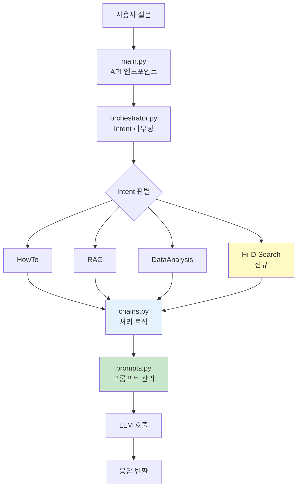

# LGD 2025 GenBI Spotfire 문서 포털

!!! info "프로젝트 정보"
    **프로젝트명**: Spotfire Copilot 외부 API 연동  
    **시작일**: 2025년 11월 12일  
    **목적**: Hi-D Search(Data) API 연동 및 Intent 확장

## 📚 문서 개요

이 문서 포털은 LG Display GenBI Spotfire Copilot 프로젝트의 모든 기술 문서와 비즈니스 요구사항을 제공합니다.

---

## 🎯 주요 문서

### 프로젝트 개요
- **[착수 보고서](kickoff_report.md)**: 프로젝트 배경, 목표, 추진 전략 및 일정

### 개발 가이드
- **[개발자용 코드 리뷰](code_review_for_developers.md)**: Intent 추가 방법 및 외부 API 연동 가이드

### 비즈니스 요구사항
- **[고객 확인사항](customer_business_questions.md)**: API 연동 전 필수 체크리스트

---

## 🚀 프로젝트 목표

### Hi-D Search(Data) API 연동을 통한 Spotfire Copilot 기능 확장

**Hi-D Search(Data)란?**
- LG디스플레이의 지표 데이터 조회 시스템
- 생산·품질·공정 등 분석 데이터 제공
- 실시간 데이터 접근 및 활용 가능

**주요 목표**

1. **Hi-D Search(Data) API 연동 구조 구축**
   - Copilot에 API 호출 메커니즘 추가
   - 안정적이고 확장 가능한 구조 설계

2. **신규 Intent 추가**
   - Hi-D Search 데이터 기반 질의응답
   - 실시간 지표 정보 제공

3. **안정적 워크플로 확립**
   - 요청 → Intent 판별 → API 호출 → AI 답변
   - 에러 처리 및 모니터링 체계

---

## 🏗️ 시스템 아키텍처



---

## 📊 기대 효과

### 사용자 경험 개선
- Copilot 내에서 Hi-D Search 데이터 직접 조회 가능
- 별도 시스템 접속 없이 통합 인터페이스 제공
- 자연어 질문으로 데이터 접근

### 업무 효율 향상
- 데이터 조회를 위한 시스템 이동 시간 절감
- 반복적인 조회 작업 자동화
- 실시간 데이터 기반 분석 가능

### 시스템 확장성
- 향후 다른 API 연동 시 재사용 가능한 구조 확보
- Intent 기반 확장 가능한 아키텍처
- 표준화된 연동 패턴 수립

---

## 🔍 사용 시나리오

### Before
```
사용자: "오늘 A라인 수율 데이터 보여줘"
→ Hi-D Search 접속 → 로그인 → 검색 → 조회
```

### After
```
사용자: "오늘 A라인 수율 데이터 보여줘"
Copilot: "A라인 수율 데이터를 조회했습니다..."
→ Copilot에서 즉시 제공
```

---

## 📅 추진 단계


| 단계 | 주요 활동 | 핵심 산출물 |
|------|----------|------------|
| 1단계 | 요건 정의 및 환경 정비 | API 사양 확보, 테스트 환경 |
| 2단계 | Intent/프롬프트 설계 | prompts.py 코드 |
| 3단계 | Chain 구현 | chains.py, orchestrator.py 코드 |
| 4단계 | 테스트 및 모니터링 | 테스트 통과, 모니터링 구축 |
| 5단계 | 배포 및 운영 이행 | 운영 배포, 안정화 확인 |

---

## 📖 문서 네비게이션

!!! tip "문서 활용 가이드"
    - **프로젝트 매니저**: [착수 보고서](kickoff_report.md) 참조
    - **개발자**: [개발자용 코드 리뷰](code_review_for_developers.md) 참조
    - **비즈니스 담당자**: [고객 확인사항](customer_business_questions.md) 참조

---

## 📞 문의

프로젝트 관련 문의사항은 프로젝트 담당자에게 연락해주세요.

---

*최종 업데이트: 2025년 11월 12일*

