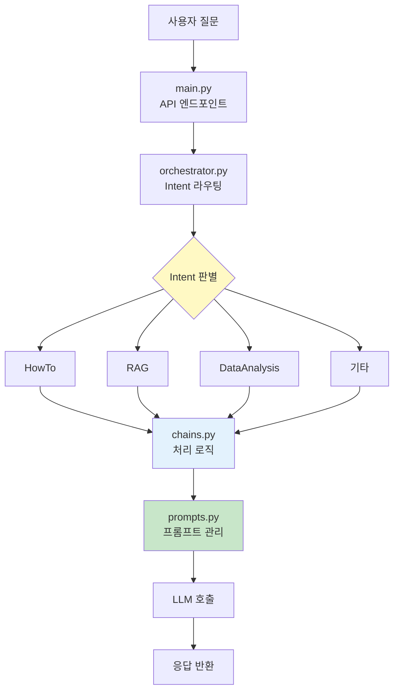

# Spotfire Copilot 외부 API 연동

**프로젝트명**: Spotfire Copilot 외부 API 연동 및 Intent 확장  
**착수일**: 2025년 11월 12일  
**문서 버전**: v1.0


## 1. 프로젝트 개요

### 1.1. 프로젝트 배경

**현재 상황**
- Spotfire Copilot은 내부 데이터 분석에 제한됨
- LG디스플레이 지표·분석 데이터에 직접 접근 불가
- 실시간 데이터 조회 및 활용 미지원

**제약사항**
- Hi-D Search(Data) 시스템 연동 부재
- 생산 지표, 품질 데이터 등 실시간 조회 불가
- 데이터 통합 분석 제한


### 1.2. 프로젝트 목적

**Hi-D Search(Data) API 연동**을 통한 Spotfire Copilot 기능 확장

**Hi-D Search(Data)란?**
- LG디스플레이의 지표 데이터 조회 시스템
- 생산·품질·공정 등 분석 데이터 제공
- 실시간 데이터 접근 및 활용 가능

**주요 목표**

1. **Hi-D Search(Data) API 연동 구조 구축**
   - Copilot에 API 호출 메커니즘 추가
   - 안정적이고 확장 가능한 구조 설계

2. **신규 Intent 추가**
   - Hi-D Search 데이터 기반 질의응답
   - 실시간 지표 정보 제공

3. **안정적 워크플로 확립**
   - 요청 → Intent 판별 → API 호출 → AI 답변
   - 에러 처리 및 모니터링 체계


### 1.3. 추진 배경

**비즈니스 요구**
- 생산·품질 지표의 실시간 조회 필요
- 내부 데이터와 Hi-D Search 데이터 통합 분석
- 단일 플랫폼에서 모든 데이터 접근

**기술적 실현성**
- LangChain 기반으로 API 연동 용이
- 명확한 Intent 메커니즘 보유
- 3개 파일 수정으로 구현 가능

**확장성**
- 1개 API 연동 후 N개 확장 가능
- 표준 프레임워크 수립


### 1.4. 기대 효과

**사용자 경험 개선**
- Copilot 내에서 Hi-D Search 데이터 직접 조회 가능
- 별도 시스템 접속 없이 통합 인터페이스 제공
- 자연어 질문으로 데이터 접근

**업무 효율 향상**
- 데이터 조회를 위한 시스템 이동 시간 절감
- 반복적인 조회 작업 자동화
- 실시간 데이터 기반 분석 가능

**시스템 확장성**
- 향후 다른 API 연동 시 재사용 가능한 구조 확보
- Intent 기반 확장 가능한 아키텍처
- 표준화된 연동 패턴 수립

**사용 시나리오**

Before:
```
사용자: "오늘 A라인 수율 데이터 보여줘"
→ Hi-D Search 접속 → 로그인 → 검색 → 조회
```

After:
```
사용자: "오늘 A라인 수율 데이터 보여줘"
Copilot: "A라인 수율 데이터를 조회했습니다..."
→ Copilot에서 즉시 제공
```


**프로젝트 개요 요약**

| 항목 | 내용 |
|------|------|
| **배경** | 내부 데이터 한정, Hi-D Search 미연동 |
| **목적** | Hi-D Search(Data) API 연동 |
| **대상 시스템** | LG디스플레이 지표·분석 데이터 조회 API |
| **기대효과** | 사용자 경험 개선, 업무 효율 향상, 시스템 확장성 확보 |
| **개발 규모** | 3개 핵심 파일 수정 (prompts.py, chains.py, orchestrator.py) |


## 2. 프로젝트 범위 및 목표

### 2.1. 프로젝트 범위

**포함 범위 (In Scope)**


1. **Hi-D Search(Data) API 연동**
   - API 호출 메커니즘 구현
   - 인증 및 보안 설정
   - 에러 처리 로직

2. **신규 Intent 추가**
   - prompts.py에 Intent 정의
   - chains.py에 Chain 구현
   - orchestrator.py에 라우팅 추가

3. **테스트 및 검증**
   - 단위 테스트
   - 통합 테스트
   - API 연동 테스트

4. **기본 문서화**
   - 코드 주석
   - 개발 가이드
   - 운영 매뉴얼


**제외 범위 (Out of Scope)**

1. **Spotfire 코어 수정**
   - Spotfire 자체 기능 변경 없음
   - Copilot 이외 영역 수정 없음

2. **Hi-D Search API 개발**
   - API 자체는 기존 시스템 활용
   - API 기능 추가/변경 제외

3. **대규모 성능 최적화**
   - 기본 성능 확보 후 별도 검토
   - 캐싱, 병렬 처리 등은 2차 고려

4. **다중 API 동시 연동**
   - 1차는 Hi-D Search(data) 만 진행
   - 추가 API는 향후 확장


### 2.2. 프로젝트 목표

**주요 목표**

1. **API 연동 구조 확립**
   - Spotfire Copilot에서 Hi-D Search 데이터 조회 가능
   - 안정적이고 확장 가능한 연동 패턴 수립

2. **사용자 경험 개선**
   - Copilot 내에서 Hi-D Search 데이터 직접 접근
   - 자연어 질문으로 데이터 조회

3. **확장 기반 마련**
   - 향후 다른 API 연동 시 재사용 가능한 구조
   - 표준화된 개발 프로세스 정립


**세부 목표**

**기술적 목표**
- Hi-D Search API 정상 호출 및 응답 처리
- 에러 상황 대응 (Timeout, 인증 실패 등)
- 기존 Copilot 기능과의 무결성 유지

**비즈니스 목표**
- 생산·품질 지표 실시간 조회 지원
- 데이터 조회 프로세스 간소화
- 사용자 편의성 향상

**운영 목표**
- 안정적인 서비스 제공
- 모니터링 및 로깅 체계 확보
- 유지보수 용이성 확보


### 2.3. 성공 기준

**기술적 성공 기준**

| 항목 | 기준 |
|------|------|
| API 연동 | Hi-D Search API 정상 호출 및 데이터 수신 |
| 응답 처리 | 조회 결과의 정확한 파싱 및 전달 |
| 에러 처리 | 장애 상황에서도 Copilot 정상 작동 |
| 호환성 | 기존 Intent 기능 정상 동작 |

**비즈니스 성공 기준**

| 항목 | 기준 |
|------|------|
| 기능 동작 | 사용자가 Hi-D Search 데이터 조회 가능 |
| 사용성 | 자연어 질문으로 데이터 접근 |
| 안정성 | 서비스 중단 없이 배포 완료 |

**인수 조건**

- Hi-D Search API 연동 정상 동작
- 주요 시나리오 테스트 통과
- 에러 케이스 처리 확인
- 기존 기능 영향 없음 확인
- 운영 문서 작성 완료


## 3. 현황 분석

### 3.1. 현재 시스템 구조

**Spotfire Copilot 아키텍처**



**핵심 구조**
- `main.py`: FastAPI 기반 REST API
- `orchestrator.py`: Intent별 분기 처리
- `chains.py`: LangChain 기반 실행 로직
- `prompts.py`: Intent 정의 및 프롬프트 관리

**현재 지원 Intent (대표 예시)**

| Intent | 용도 | 데이터 소스 |
|--------|------|------------|
| HowTo | 사용법 안내 | 내장 문서 |
| HowToRAG | 문서 검색 | Vector DB |
| SpecificDataQuestionGraph | 데이터 분석 | Spotfire 데이터 |
| ImageAnalysis | 이미지 분석 | 멀티모달 |


### 3.2. 현황 진단 (SWOT)

**강점 (Strength)**

- 명확한 Intent 기반 아키텍처
  - 새로운 기능 추가 시 기존 구조 재사용 가능
  
- LangChain 프레임워크 활용
  - 외부 API 연동을 위한 Runnable 구조 이미 갖춤
  
- 모듈화된 코드 구조
  - 3개 파일만 수정하면 신규 Intent 추가 가능

**약점 (Weakness)**

- 내부 데이터에 한정
  - Spotfire에 로드된 데이터만 분석 가능
  - 외부 시스템 데이터 접근 불가
  
- 실시간 데이터 조회 미지원
  - Hi-D Search 같은 실시간 시스템 연동 없음

**기회 (Opportunity)**

- Hi-D Search 연동으로 활용도 확대
  - 생산·품질 지표 직접 조회 가능
  
- 확장 가능한 패턴 확립
  - 이후 다른 API 연동 시 재사용

**위협 (Threat)**

- API 의존성 증가
  - Hi-D Search 장애 시 영향 검토 필요
  
- 응답 시간 변동
  - 외부 API 속도에 따라 사용자 경험 영향


### 3.3. 분석 결과 및 개선 방향

**주요 발견사항**

1. **기술적 준비도**: 양호
   - Intent 확장 구조 이미 갖춤
   - LangChain 기반으로 API 연동 용이
   - 코드 수정 범위 명확 (3개 파일)

2. **기능적 제약**: 명확
   - 외부 데이터 접근 불가가 핵심 제약
   - Hi-D Search 연동이 직접적인 해결책

3. **리스크**: 관리 가능
   - 주요 리스크는 API 의존성
   - 에러 처리 및 Fallback 전략으로 대응 가능

**개선 방향**

| 영역 | 현재 | 개선 후 |
|------|------|---------|
| **데이터 접근** | Spotfire 내부만 | Hi-D Search 추가 |
| **질문 범위** | 내부 데이터 관련 | 생산·품질 지표 포함 |
| **확장성** | 제한적 | API 연동 패턴 확립 |

**기술적 접근**
- 기존 구조 최대한 활용
- 3개 파일 수정으로 최소 영향
- 에러 처리로 안정성 확보
- 모니터링으로 품질 관리


**현황 분석 요약**

| 구분 | 내용 |
|------|------|
| **현재 구조** | Intent 기반, 모듈화된 아키텍처 |
| **강점** | 확장 가능한 구조, LangChain 활용 |
| **약점** | 외부 데이터 접근 불가 |
| **기회** | Hi-D Search 연동으로 활용도 확대 |
| **위협** | API 의존성, 응답 시간 변동 |
| **결론** | 기술적으로 준비됨, 리스크 관리 가능 |


## 4. 추진 전략 및 방법론

### 4.1. 추진 전략

**기본 원칙**

1. **점진적 확장**
   - Hi-D Search(Data) API 단일 연동 우선
   - 검증 완료 후 다른 API로 확장

2. **기존 구조 최대 활용**
   - Spotfire Copilot 기존 아키텍처 유지
   - 핵심 3개 파일만 수정

3. **최소 영향 원칙**
   - 기존 기능 변경 없음
   - 신규 Intent 추가만 진행


**실행 방향**

| 구분 | 접근 방법 |
|------|----------|
| 개발 | 모듈형 추가 개발 (기존 코드 최소 수정) |
| 테스트 | 단계별 검증 (단위 → 통합 → 인수) |
| 배포 | 무중단 배포 (기존 기능 영향 없음) |
| 모니터링 | 실시간 로깅 및 에러 추적 |


### 4.2. 개발 방법론

**애자일 기반 개발**

- 짧은 개발 주기 (1-2주 단위)
- 단계별 검증 및 피드백
- 고객과의 지속적 협업

**핵심 원칙**

1. **간결함 (Simplicity)**
   - 복잡한 구조 지양
   - 명확한 코드 작성

2. **재사용성 (Reusability)**
   - 향후 다른 API 연동 시 재사용 가능
   - 표준 패턴 수립

3. **안정성 (Stability)**
   - 에러 처리 철저
   - 기존 기능 영향 없음


**기술 스택**

| 계층 | 기술 |
|------|------|
| API Framework | FastAPI |
| LLM Framework | LangChain |
| 프롬프트 관리 | prompts.py (dict 기반) |
| API 클라이언트 | requests / httpx |


### 4.3. 단계별 추진 계획

**전체 개요**


#### 4.3.1. 1단계: 요건 정의 및 환경 정비

**주요 활동**
- Hi-D Search API 사양 확인
- 인증 방식 및 보안 정책 파악
- 테스트 환경 설정

**산출물**
- API 명세서
- 환경변수 설정
- 테스트 계정 발급

**완료 기준**
- API 사양 문서 확보
- 테스트 환경에서 API 호출 성공
- 보안 검토 완료


#### 4.3.2. 2단계: Intent/프롬프트 설계

**주요 활동**
- Intent 이름 및 역할 정의
- 시스템 프롬프트 작성
- 대표 질문 목록 수집

**산출물**
- Intent 설계 문서
- 프롬프트 초안
- 테스트 질문 목록 (10개 이상)

**완료 기준**
- Intent 이름 확정
- 프롬프트 고객 승인
- prompts.py 코드 작성 완료


#### 4.3.3. 3단계: Chain 구현

**주요 활동**
- API 호출 함수 작성
- 데이터 파싱 및 가공 로직
- 에러 처리 구현
- Orchestrator 라우팅 연결

**산출물**
- chains.py 신규 Chain 함수
- orchestrator.py 라우팅 분기
- 단위 테스트 코드

**완료 기준**
- API 호출 정상 작동
- 에러 처리 검증 완료
- Orchestrator 연결 확인


#### 4.3.4. 4단계: 테스트 및 모니터링

**주요 활동**
- 단위 테스트
- 통합 테스트
- UAT (사용자 인수 테스트)
- 모니터링 설정

**테스트 범위**

| 구분 | 내용 |
|------|------|
| 단위 테스트 | API 호출, 데이터 파싱 |
| 통합 테스트 | Copilot 전체 플로우 |
| 에러 테스트 | Timeout, 인증 실패 등 |
| 성능 테스트 | 응답 시간 확인 |

**완료 기준**
- 모든 테스트 케이스 통과
- UAT 승인
- 모니터링 대시보드 구축


#### 4.3.5. 5단계: 배포 및 운영 이행

**주요 활동**
- 운영 환경 배포
- 모니터링 시작
- 사용자 가이드 배포
- 운영팀 교육

**산출물**
- 배포 체크리스트
- 운영 매뉴얼
- 장애 대응 가이드

**완료 기준**
- 운영 환경 배포 완료
- 1주일간 안정 운영 확인
- 운영팀 인수인계 완료


### 4.4. 기술 구현 방안

**핵심 구현 내용**

**1) prompts.py - Intent 정의**

```python
_hid_search_data = {
    "system_prompt": """당신은 Hi-D Search(Data) API를 호출할 수 있는 도우미임.
사용자가 생산 지표나 품질 데이터를 요청하면 API에서 조회하여 답변함.""",
    "llm_name": CHAT_COMPLEX_MODEL_NAME,
    "temperature": 0.2
}

prompt_dict["HiDSearch_Data"] = _hid_search_data
```


**2) chains.py - API 호출 Chain**

```python
def getHiDSearchDataChain(config):
    # 1. API 호출
    api_response = call_hid_search_api(config.query)
    
    # 2. 데이터 가공
    processed_data = process_api_response(api_response)
    
    # 3. LLM으로 답변 생성
    chain = ChatPromptTemplate.from_messages([
        ("system", get_system_prompt("HiDSearch_Data")),
        ("user", f"데이터: {processed_data}\n질문: {config.query}")
    ]) | llm
    
    return chain
```


**3) orchestrator.py - 라우팅 추가**

```python
def processRequest(self, request_config):
    user_intent = request_config.user_intent
    
    if user_intent == "HiDSearch_Data":
        result = self.__executeHiDSearchDataChain(request_config)
    else:
        # 기존 로직
        ...
    
    return result
```


**에러 처리 전략**

| 에러 유형 | 대응 방안 |
|----------|----------|
| Timeout | 5초 제한, 대체 메시지 제공 |
| 인증 실패 | 로그 기록, 관리자 알림 |
| 데이터 없음 | "조회 결과 없음" 안내 |
| API 장애 | 기존 Copilot 기능은 정상 유지 |


**모니터링 항목**

- API 호출 성공률
- 평균 응답 시간
- 에러 발생 빈도
- 사용량 추이


## 5. 프로젝트 일정

**전체 개발 기간**

- API 사양 확인 후 상세 일정 수립 예정
- 5단계 순차 진행 (준비 → 설계 → 구현 → 테스트 → 배포)


**주요 마일스톤**

| 단계 | 주요 활동 | 핵심 산출물 |
|------|----------|------------|
| 1단계 | 요건 정의 및 환경 정비 | API 사양 확보, 테스트 환경 |
| 2단계 | Intent/프롬프트 설계 | prompts.py 코드 |
| 3단계 | Chain 구현 | chains.py, orchestrator.py 코드 |
| 4단계 | 테스트 및 모니터링 | 테스트 통과, 모니터링 구축 |
| 5단계 | 배포 및 운영 이행 | 운영 배포, 안정화 확인 |


**핵심 체크포인트**

- API 사양 확인 완료
- 프롬프트 고객 승인
- 코드 구현 완료
- UAT 승인
- 운영 배포 완료


## 6. 품질 관리

### 6.1. 품질 목표

**기능 품질**

| 항목 | 목표 |
|------|------|
| API 연동 성공률 | 정상 상황에서 100% |
| 응답 정확성 | API 데이터 정확히 전달 |
| 에러 처리 | 모든 에러 상황 대응 |

**성능 품질**

| 항목 | 목표 |
|------|------|
| 응답 시간 | 5초 이내 (Timeout 포함) |
| 가용성 | 기존 Copilot 기능 100% 유지 |

**코드 품질**

| 항목 | 목표 |
|------|------|
| 코드 리뷰 | 모든 코드 리뷰 완료 |
| 단위 테스트 | 핵심 함수 테스트 커버리지 확보 |
| 문서화 | 코드 주석 및 개발 가이드 작성 |


### 6.2. 테스트 전략

**테스트 단계**


**1) 단위 테스트**

| 대상 | 테스트 내용 |
|------|------------|
| API 호출 함수 | 정상 호출, Timeout, 에러 응답 |
| 데이터 파싱 | 다양한 응답 포맷 처리 |
| 에러 처리 | 각 에러 유형별 처리 확인 |


**2) 통합 테스트**

| 대상 | 테스트 내용 |
|------|------------|
| Intent 라우팅 | Hi-D Search Intent 정상 분기 |
| 전체 플로우 | 질문 → API 호출 → 답변 생성 |
| 기존 기능 | 다른 Intent 영향 없음 확인 |


**3) UAT (사용자 인수 테스트)**

**테스트 시나리오**

| 번호 | 시나리오 | 기대 결과 |
|------|----------|----------|
| 1 | "A라인 수율 데이터 보여줘" | API 조회 후 데이터 제공 |
| 2 | "오늘 B라인 품질 지표는?" | 정상 데이터 반환 |
| 3 | API 장애 상황 | 에러 메시지, Copilot은 정상 |
| 4 | 존재하지 않는 데이터 조회 | "조회 결과 없음" 안내 |
| 5 | 기존 Copilot 질문 | 기존 기능 정상 작동 |

**UAT 참여자**: 3-5명 (실제 사용자)


### 6.3. 검수 기준

**기능 검수**

- Hi-D Search API 정상 호출
- 응답 데이터 정확히 파싱 및 전달
- 모든 에러 케이스 처리 확인
- 기존 Intent 기능 영향 없음

**성능 검수**

- 응답 시간 5초 이내
- Timeout 설정 정상 작동
- 동시 요청 처리 확인

**운영 검수**

- 로깅 정상 작동
- 모니터링 대시보드 구축
- 운영 문서 작성 완료
- 장애 대응 절차 수립

**최종 인수 조건**

- 모든 UAT 시나리오 통과
- 고객 승인
- 1주일간 안정 운영 확인


## 7. 착수 준비 현황

### 7.1. 사전 준비 완료 사항

**문서화**
- Spotfire Copilot 코드 분석 완료
- 고객 질문 체크리스트 작성
- 개발 가이드 작성

**기술 검토**
- 현재 시스템 구조 파악 완료
- Intent 추가 방식 확인
- LangChain 기반 API 연동 패턴 검토

### 7.2. 해결 필요 사항

**고객 확인 필요**

| 항목 | 내용 | 우선순위 |
|------|------|---------|
| API 사양 | Hi-D Search API 상세 명세 확보 | 높음 |
| 테스트 환경 | API Key 발급 및 접근 권한 | 높음 |
| 네트워크 정책 | 방화벽, VPN 설정 확인 | 중 |
| 일정 | 납기일 및 마일스톤 확정 | 중 |
| 담당자 | 프로젝트 담당자 지정 | 중 |


## 8. 향후 계획

### 8.1. 단기 계획 (1개월)

**1주차: 요건 정의**
- 고객 미팅 및 질문 체크리스트 작성
- API 사양 확인 및 문서화
- 테스트 환경 구성

**2주차: 설계**
- Intent 이름 및 프롬프트 설계
- 고객 검토 및 승인
- prompts.py 코드 작성

**3주차: 구현**
- chains.py API 호출 구현
- orchestrator.py 라우팅 추가
- 단위 테스트

**4주차: 테스트 및 배포**
- 통합 테스트
- UAT
- 운영 배포 준비

## 8. 프로젝트 요약

**프로젝트 목적**
- Hi-D Search(Data) API를 Spotfire Copilot에 연동
- LG디스플레이 지표 데이터 실시간 조회 기능 제공
- 향후 다른 API 연동을 위한 확장 가능한 구조 확립

**기술적 타당성**
- Spotfire Copilot의 Intent 기반 아키텍처는 신규 기능 추가에 적합함
- LangChain 프레임워크로 API 연동이 용이함
- 3개 파일 수정으로 구현 가능 (prompts.py, chains.py, orchestrator.py)

**기대 효과**
- 사용자 경험 개선: Copilot에서 Hi-D Search 데이터 직접 조회
- 업무 효율 향상: 시스템 이동 시간 절감, 실시간 데이터 활용
- 시스템 확장성: 표준화된 API 연동 패턴 수립
